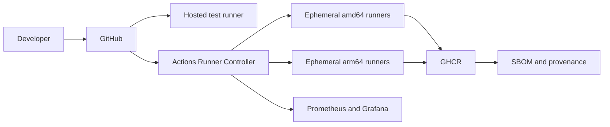

# Architecture

Pull requests run tests, static analysis, cross-compilation, a multi-platform container build, and vulnerability scanning. Tagged commits publish a manifest-list image for `linux/amd64` and `linux/arm64`, along with BuildKit SBOM and provenance attestations.

Actions Runner Controller creates short-lived Kubernetes runner pods and scales them according to queue demand. ARM64 jobs select nodes using `kubernetes.io/arch: arm64`. Production environments should use isolated node pools and ephemeral runners because CI jobs execute repository-controlled code.

## Design decisions

- **Native runners plus emulation:** native ARM64 runners expose architecture-specific failures; QEMU remains useful for inexpensive manifest validation.
- **Zero idle runners:** `minRunners: 0` limits cost, with a cold-start penalty for the first queued job.
- **Distroless workload:** reduces image size and attack surface, but removes interactive shell debugging.
- **GitHub cache backend:** easy to operate for a portfolio project; large organizations may use a shared remote BuildKit cache.

